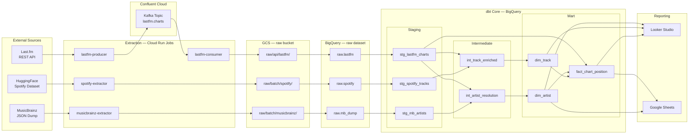
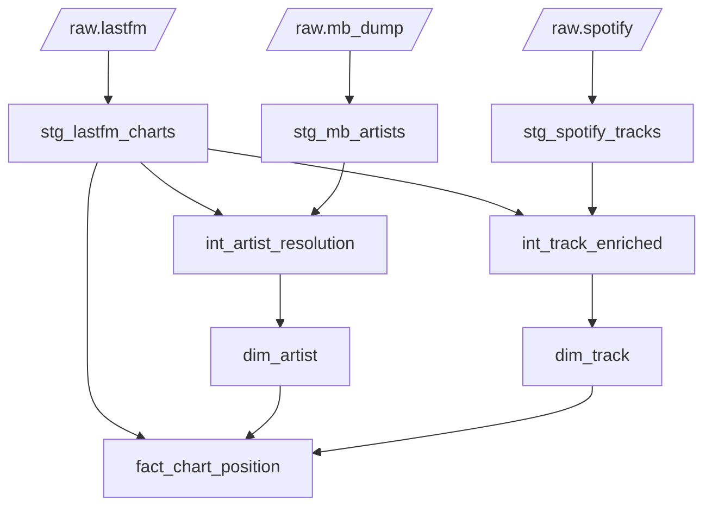
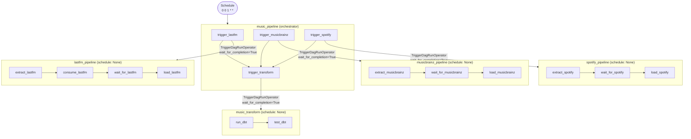

# Technical Design Document — gcp-music-0001

**Status:** In Development  
**Last updated:** 2026-05-19  
**Author:** David Bryne Adedeji

---

## 1. Overview

A monthly music intelligence pipeline that ingests chart, artist, and track data from three external sources, unifies them in BigQuery via dbt, and surfaces insights through Looker Studio and Google Sheets. The pipeline runs on the first of each month, orchestrated by Airflow on Astronomer Cloud, with all infrastructure provisioned on GCP via an idempotent gcloud CLI bootstrap script.

The central analytical question: **which artists and tracks are dominating charts, and what do we know about them?**

---

## 2. Goals

- Ingest Last.fm weekly chart data, MusicBrainz artist metadata, and a Spotify tracks dataset on a monthly cadence
- Produce a clean dimensional model (`dim_artist`, `dim_track`, `fact_chart_position`) in BigQuery
- Resolve artist identities across sources using MusicBrainz MBID as the canonical key
- Deliver four dashboard pages in Looker Studio and a structured Google Sheets report

---

## 3. Non-Goals

- Real-time or sub-daily data freshness
- Track audio feature analysis beyond what the Spotify dataset provides
- User-level listening history (aggregate chart data only)

---

## 4. Stack

| Layer | Technology |
|:---|:---|
| Extraction | Cloud Run Jobs, Python 3.12, Pydantic |
| Messaging | Apache Kafka — Confluent Cloud |
| Storage | Google Cloud Storage |
| Warehousing | Google BigQuery |
| Transformation | dbt Core + dbt-utils |
| Orchestration | Astronomer Cloud (managed Airflow) |
| Reporting | Looker Studio, Google Sheets |
| IaC | gcloud CLI (Shell) |
| CI/CD | GitHub Actions |
| Secrets | GCP Secret Manager |
| Region | `europe-west2` (London) |

---

## 5. Architecture

### 5.1 High-level diagram



---

### 5.2 Data sources

| Source | Type | Cadence | Volume |
|:---|:---|:---|:---|
| Last.fm `chart.getTopArtists` | REST API | Monthly run, paginated | ~50 artists/page, all pages |
| MusicBrainz artist dump | Batch download (`artist.tar.xz`) | Monthly | ~2M artist records, 2 GB compressed |
| Spotify tracks dataset | HuggingFace Parquet (`maharshipandya/spotify-tracks-dataset`) | Monthly snapshot | ~114k tracks, 13.6 MB |

---

### 5.3 Extraction layer

Four Cloud Run Jobs — stateless, run to completion, scale to zero.

**`lastfm-producer`** (`extractors/lastfm-producer/`)

Paginates `chart.getTopArtists` at 0.2 s per page (5 req/s limit). Each artist is validated as an `ArtistChart` Pydantic record and produced to the `lastfm.charts` Kafka topic on Confluent Cloud. Empty MBIDs from the API are normalised to `None`. Delivery errors are surfaced via the on_delivery callback and raised after `flush()` so no failures are silently swallowed.

**`lastfm-consumer`** (`extractors/lastfm-consumer/`)

Drains the `lastfm.charts` topic using a 30-second silence window (6 × 5 s empty polls). Stamps a single `_ingested_at` UTC timestamp across all records in the batch, then writes NDJSON to `raw/api/lastfm/{chart_week}.ndjson`. Kafka offsets are committed only after a successful GCS write — failed writes can be replayed by re-running the job.

**`musicbrainz-extractor`** (`extractors/musicbrainz/`)

Resolves the latest dump version via the `LATEST` file, streams `artist.tar.xz` in 8 MB chunks computing SHA256 in parallel, verifies the checksum against `SHA256SUMS`, then stream-extracts the NDJSON from the XZ tarball. Only the nine fields the pipeline needs are retained (hyphenated keys normalised to snake_case, `life-span` flattened, genres reduced to a name list). Reduces GCS footprint from the full 2 GB dump to a compact filtered NDJSON.

**`spotify-extractor`** (`extractors/spotify/`)

Downloads the auto-generated Parquet export from HuggingFace (`refs/convert/parquet` revision), drops the serialised DataFrame index column (`Unnamed: 0`), stamps `_ingested_at`, and stages to `raw/batch/spotify/spotify_tracks.parquet`.

---

### 5.4 Storage layout

```
gs://portfolio-hub-2026-music-raw/
  raw/
    api/
      lastfm/            {chart_week}.ndjson   — one file per consumer run
    batch/
      musicbrainz/       mb_artists.ndjson     — filtered artist dump
      spotify/           spotify_tracks.parquet
```

---

### 5.5 BigQuery

| Dataset | Tables | Purpose |
|:---|:---|:---|
| `raw` | `lastfm`, `mb_dump`, `spotify` | GCS load targets — schema defined in `infra/schemas/*.json` |
| `music` | dbt mart models | Dimensional models consumed by reporting |

Table schemas are defined in `infra/schemas/*.json` — single source of truth used by both `bootstrap.sh` (table creation) and the Airflow DAGs (`GCSToBigQueryOperator`).

---

## 6. dbt Model Lineage



### Model notes

**Staging** — all fully implemented

- `stg_lastfm_charts` — casts types, generates `chart_key` surrogate on `artist_name + chart_week` (not MBID, which is nullable), passes through `_ingested_at`
- `stg_mb_artists` — maps confirmed dump fields; parses `begin_date`/`end_date` strings via `safe.parse_date`; `artist_type` validated with `accepted_values`
- `stg_spotify_tracks` — full confirmed schema from HuggingFace dataset inspection; range tests on all 0–1 audio features, `popularity` 0–100, `key` 0–11, `mode` accepted_values [0, 1]

**Intermediate** — logic pending

- `int_artist_resolution` — joins Last.fm and MusicBrainz on MBID; `is_mb_verified` flag set. Name-normalisation fallback for records without MBID is not yet implemented.
- `int_track_enriched` — joins Last.fm chart records with Spotify tracks on normalised artist + track name. Matching logic not yet implemented.

**Mart**

- `dim_artist` — one row per artist, MBID as natural key, surrogate `artist_key`
- `dim_track` — one row per track, `track_key` surrogate
- `fact_chart_position` — one row per artist × chart week; `track_key` join deferred until `int_track_enriched` matching is complete

---

## 7. Orchestration

Five DAGs on Astronomer Cloud. `music_pipeline` is the only scheduled DAG; the rest run on trigger only, preventing race conditions and unintended runs.



Each `TriggerDagRunOperator` uses `wait_for_completion=True` and `poke_interval=60` — the orchestrator blocks on each sub-DAG and only advances when it succeeds. A failure in one source does not affect the others and can be restarted in isolation without re-running the full pipeline.

---

## 8. Infrastructure

All GCP resources are provisioned by `infra/bootstrap.sh` using `gcloud` and `bq` CLI commands. The script is idempotent — it checks existence before every create. It runs automatically on every merge to `main` via GitHub Actions.

**Provisioned**
- GCS bucket (`portfolio-hub-2026-music-raw`) with uniform bucket-level access
- BigQuery datasets: `raw`, `music`
- BigQuery raw tables: `raw.lastfm`, `raw.mb_dump`, `raw.spotify` (schemas from `infra/schemas/`)
- Artifact Registry repository: `music-pipeline` (Docker, `europe-west2`)
- Secret Manager secrets: `lastfm-api-key`, `kafka-bootstrap-servers`, `kafka-api-key`, `kafka-api-secret`
- Service accounts: `music-cloudrun-sa`, `music-airflow-sa`
- IAM bindings:
  - `music-cloudrun-sa` → `storage.objectAdmin` on raw bucket, `bigquery.dataEditor` + `bigquery.jobUser` at project, `secretmanager.secretAccessor` on all secrets
  - `music-airflow-sa` → `run.invoker` at project, `storage.objectViewer` + read on raw bucket, `bigquery.jobUser` + `bigquery.dataEditor` at project
- Cloud Run Jobs: `lastfm-producer`, `lastfm-consumer`, `musicbrainz-extractor`, `spotify-extractor`

**Pending**
- Cloud Run Job: `dbt-runner` (requires a dedicated dbt Docker image, not yet in CI)
- GCS lifecycle rules (raw data retention)

**Manual (not in script)**
- GitHub Actions SA (`github-actions-sa`) — created by hand; `SERVICE_ACCOUNT` secret set in GitHub repository settings
- Secret values — added via GCP console after secrets are created

---

## 9. Security

- All credentials stored in Secret Manager; Cloud Run Jobs access them as environment variables at runtime via the `music-cloudrun-sa` service account
- No credentials committed to source control; `.env.example` documents required variables
- Uniform bucket-level access removes per-object ACLs
- IAM follows least privilege per service account — each SA is scoped to only the operations it performs

---

## 10. CI/CD

GitHub Actions (`.github/workflows/ci.yml`).

**On every PR and push to main:**
- `validate-dbt` — writes a CI dbt profile, runs `dbt deps` + `dbt parse` to validate all model SQL without a live BigQuery connection
- `test-extractors` (matrix: `lastfm-producer`, `lastfm-consumer`, `musicbrainz`, `spotify`) — installs requirements and runs pytest for each extractor
- `validate-docker` (matrix: same four) — builds each Docker image to confirm Dockerfiles are valid; no push

**On merge to `main` only:**
- `deploy-infra` — authenticates to GCP, runs `infra/bootstrap.sh`
- `deploy-images` — builds and pushes extractor images to Artifact Registry tagged with commit SHA and `latest` (runs after `deploy-infra`)

`deploy-infra` and `deploy-images` run in parallel where possible; `deploy-images` gates on `deploy-infra` to ensure Artifact Registry exists first.

---

## 11. Open Items

| Area | Item |
|:---|:---|
| dbt | `int_artist_resolution` — name-normalisation fallback for artists without MBID |
| dbt | `int_track_enriched` — track matching logic (normalised artist + track name join) |
| dbt | `fact_chart_position` — wire `track_key` once `int_track_enriched` is complete |
| Infra | `dbt-runner` Cloud Run Job — requires a dedicated dbt Docker image |
| Infra | GCS lifecycle rules for raw data retention |
| Manual | Populate Last.fm API key in Secret Manager |
| Reporting | Connect BigQuery to Looker Studio — build four dashboard pages |
| Reporting | Connect BigQuery to Google Sheets via native connector |
