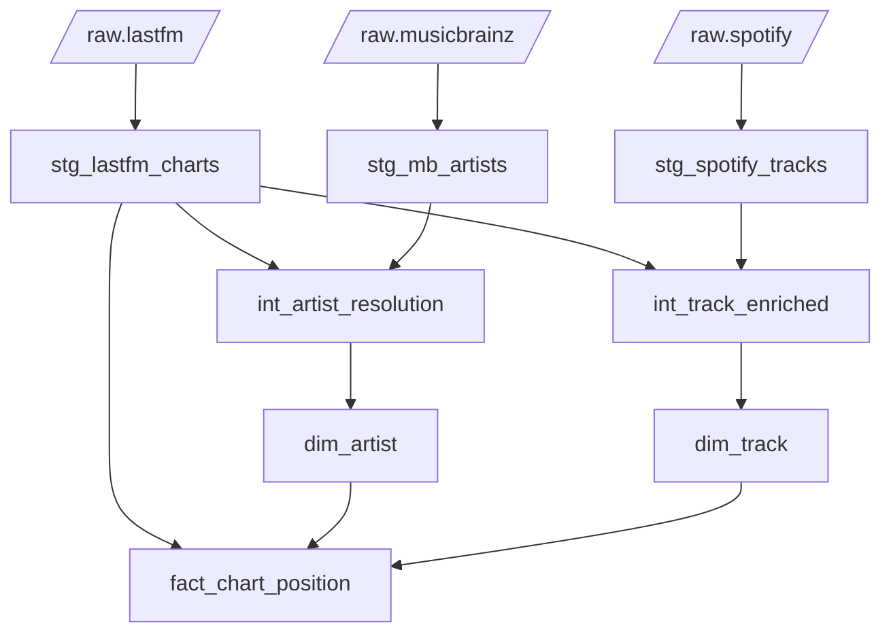
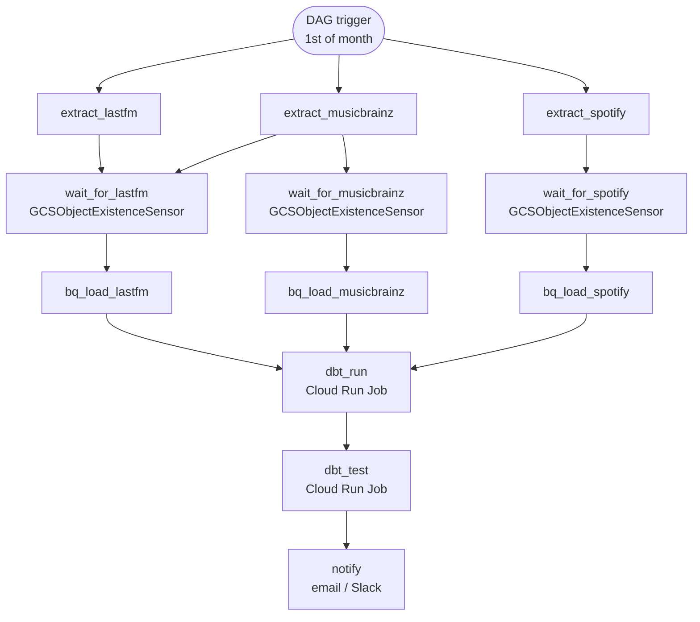

# Technical Design Document — gcp-music-0001

**Status:** In Development  
**Last updated:** 2026-05-19  
**Author:** David Bryne Adedeji

---

## 1. Overview

A monthly music intelligence pipeline that ingests chart, artist, and track data from three external sources, unifies them in BigQuery via dbt, and surfaces insights through Looker Studio and Google Sheets. The pipeline runs on the first of each month, orchestrated by Airflow on Astronomer Cloud, with all infrastructure provisioned on GCP via Pulumi.

The central analytical question: **which artists and tracks are dominating charts, and what do we know about them?**

---

## 2. Goals

- Ingest Last.fm weekly chart data, MusicBrainz artist metadata, and a Spotify tracks dataset on a monthly cadence
- Produce a clean dimensional model (`dim_artist`, `dim_track`, `fact_chart_position`) in BigQuery
- Resolve artist identities across sources using MusicBrainz MBID as the canonical key
- Deliver four dashboard pages in Looker Studio and a structured Google Sheets report

---

## 3. Non-Goals

- Real-time or sub-daily data freshness
- Track audio feature analysis beyond what the Spotify dataset provides
- User-level listening history (aggregate chart data only)

---

## 4. Stack

| Layer | Technology |
|:---|:---|
| Extraction | Cloud Run Jobs, Python 3.12, Pydantic |
| Messaging | Apache Kafka — Confluent Cloud |
| Storage | Google Cloud Storage |
| Warehousing | Google BigQuery |
| Transformation | dbt Core + dbt-utils |
| Orchestration | Astronomer Cloud (managed Airflow) |
| Reporting | Looker Studio, Google Sheets |
| IaC | gcloud CLI (Shell) |
| CI/CD | GitHub Actions |
| Secrets | GCP Secret Manager |
| Region | `europe-west2` (London) |

---

## 5. Architecture

### 5.1 High-level diagram


---

### 5.2 Data sources

| Source | Type | Cadence | Volume |
|:---|:---|:---|:---|
| Last.fm `chart.getTopArtists` | REST API | Monthly run, weekly chart pages | ~50 artists × weeks-in-month |
| MusicBrainz artist dump | Batch file download (`mbdump-artist.tar.bz2`) | Monthly | ~2M artist records |
| Spotify tracks dataset | HuggingFace Parquet (`maharshipandya/spotify-tracks-dataset`) | Monthly snapshot | ~114k tracks |

---

### 5.3 Extraction layer

Three independent Cloud Run Jobs, one per source. Each job is stateless, runs to completion, and exits — no long-running processes.

**Last.fm extractor** (`extractors/lastfm/`)

Calls `chart.getTopArtists` with pagination. Each page is an `ArtistChart` Pydantic record:

```
artist_mbid | artist_name | chart_week | rank | listeners | playcount
```

Records are serialised to JSON and produced to a Confluent Cloud Kafka topic (`lastfm.charts`). A separate consumer job (`lastfm-consumer`) drains the topic and writes NDJSON files to GCS `raw/api/lastfm/`. This decouples the API call rate from the GCS write and allows replay if the consumer fails.

**MusicBrainz extractor** (`extractors/musicbrainz/`)

Downloads `mbdump-artist.tar.bz2` from `data.metabrainz.org`, verifies checksum, decompresses, and streams the JSON to GCS `raw/batch/musicbrainz/mb_dump.json`. No intermediate Kafka hop — the dump is a static batch file.

**Spotify extractor** (`extractors/spotify/`)

Downloads the `maharshipandya/spotify-tracks-dataset` Parquet file via `huggingface-hub` and stages it directly to GCS `raw/batch/spotify/spotify_tracks.parquet`.

---

### 5.4 Storage layout

```
gs://{project}-music-raw/
  raw/
    api/
      lastfm/          NDJSON files, one per consumer run
    batch/
      musicbrainz/     mb_dump.json
      spotify/         spotify_tracks.parquet
```

Uniform bucket-level access is enabled. Lifecycle rules (retention / deletion of old raw files) are planned but not yet defined.

---

### 5.5 BigQuery datasets

| Dataset | Purpose |
|:---|:---|
| `raw` | Landing tables — GCS load jobs write here, schema matches source |
| `music` (mart) | dbt output — dimensional models consumed by reporting |

BigQuery load jobs (GCS → `raw` tables) run as part of the Airflow DAG after GCS sensors confirm file presence.

---

## 6. dbt Model Lineage



### Model notes

**Staging**
- `stg_lastfm_charts` — casts types, generates `chart_key` surrogate (MBID + week), passes through `_ingested_at`
- `stg_mb_artists` — maps MusicBrainz JSON fields; most columns currently stub `cast(null …)` pending confirmed dump schema
- `stg_spotify_tracks` — column names pending Parquet schema confirmation from HuggingFace dataset

**Intermediate**
- `int_artist_resolution` — joins Last.fm and MusicBrainz on MBID; `is_mb_verified` flag distinguishes matched vs unmatched artists. Name-normalisation fallback (for records without MBID) is not yet implemented.
- `int_track_enriched` — joins Last.fm chart records with Spotify tracks on normalised artist + track name. Matching logic not yet implemented.

**Mart**
- `dim_artist` — one row per artist, MBID as natural key, surrogate `artist_key`
- `dim_track` — one row per track, `track_key` surrogate
- `fact_chart_position` — one row per artist × chart week; `track_key` join deferred until `int_track_enriched` matching is complete

---

## 7. Orchestration

Runs monthly (`0 0 1 * *`) on Astronomer Cloud. All extraction jobs run in parallel; downstream tasks gate on GCS file presence.



> Note: `wait_for_lastfm` is not yet in the DAG code — the Last.fm path currently flows through Kafka and a consumer job, so the sensor should target the consumer's output file in GCS, not a direct extractor output. This needs to be wired up alongside the Kafka consumer implementation.

---

## 8. Infrastructure

All GCP resources are provisioned by `infra/bootstrap.sh` — a plain shell script using `gcloud` and `bq` CLI commands. The script is idempotent: it checks existence before every create, so it is safe to re-run at any time. It runs automatically via GitHub Actions on every merge to `main`.

**Provisioned**
- GCS bucket (`portfolio-hub-2026-music-raw`) with uniform bucket-level access
- BigQuery datasets: `raw`, `music`
- Artifact Registry repository: `music-pipeline` (Docker, `europe-west2`)
- Secret Manager secrets: `lastfm-api-key`, `kafka-bootstrap-servers`, `kafka-api-key`, `kafka-api-secret` (secret values added manually via console, not in script)
- Service accounts: `music-cloudrun-sa` (extractors, consumer, dbt runner), `music-airflow-sa` (Astronomer Cloud)
- IAM bindings:
  - `music-cloudrun-sa` → `storage.objectAdmin` on raw bucket, `bigquery.dataEditor` + `bigquery.jobUser` at project, `secretmanager.secretAccessor` on all secrets
  - `music-airflow-sa` → `run.invoker` at project, `storage.objectViewer` on raw bucket

**Pending**
- Cloud Run Job definitions: `lastfm-extractor`, `lastfm-consumer`, `musicbrainz-extractor`, `spotify-extractor`, `dbt-runner`
- GCS lifecycle rules (raw data retention)

**Manual (not in script)**
- GitHub Actions service account — created by hand; needs `artifactregistry.writer`, `storage.admin`, `bigquery.admin`, `secretmanager.admin`, `iam.serviceAccountAdmin`, `run.admin`
- Secret values — added via GCP console after secrets are created

---

## 9. Security

- API keys and Kafka credentials are stored in Secret Manager; Cloud Run Jobs access them via environment variable injection at runtime
- No credentials are committed to source control; `.env.example` documents required vars
- Uniform bucket-level access removes per-object ACLs
- IAM follows least privilege: each service account will be scoped to only the resources it needs (pending implementation)

---

## 10. CI/CD

GitHub Actions (`.github/workflows/ci.yml`).

**On every PR and push:**
- `dbt-compile` — installs dbt-bigquery, runs `dbt deps` + `dbt compile` to validate model SQL
- `docker-build` (matrix: lastfm, musicbrainz, spotify) — builds each extractor image to confirm Dockerfiles are valid; no push

**On merge to `main` only** (after validate jobs pass):
- `docker-push` — builds and pushes extractor images to Artifact Registry tagged with commit SHA and `latest`
- `infra-apply` — authenticates to GCP with `SERVICE_ACCOUNT` secret, runs `infra/bootstrap.sh`

`docker-push` and `infra-apply` run in parallel on main; neither blocks the other.

**Required GitHub secrets:** `SERVICE_ACCOUNT` (service account JSON key with permissions to manage GCS, BigQuery, Artifact Registry, Secret Manager, and Cloud Run).

---

## 11. Open Items

| Area | Item |
|:---|:---|
| Last.fm extractor | Implement `fetch_charts` pagination + rate limiting |
| Last.fm extractor | Implement Kafka producer (Confluent Cloud) |
| Last.fm consumer | New Cloud Run Job — drain Kafka topic → GCS |
| MusicBrainz extractor | Download + checksum verify + decompress + GCS stage |
| Spotify extractor | Confirm Parquet schema; implement `huggingface-hub` download |
| BigQuery | Define raw table schemas for all three sources |
| BigQuery | Write GCS → raw BQ load jobs |
| dbt | `stg_mb_artists` — replace `cast(null …)` stubs once schema is confirmed |
| dbt | `stg_spotify_tracks` — confirm column names from actual Parquet |
| dbt | `int_artist_resolution` — name-normalisation fallback |
| dbt | `int_track_enriched` — track matching logic |
| dbt | `fact_chart_position` — wire `track_key` once enrichment is done |
| Airflow DAG | Add BQ load tasks, dbt tasks, notification, full dependency graph |
| Airflow DAG | Add `wait_for_lastfm` GCS sensor (Kafka consumer output path) |
| Infra (`bootstrap.sh`) | Cloud Run Job definitions: lastfm-extractor, lastfm-consumer, musicbrainz-extractor, spotify-extractor, dbt-runner |
| Infra (`bootstrap.sh`) | GCS lifecycle rules (raw data retention) |
| Manual | Create GitHub Actions SA; add JSON key as `SERVICE_ACCOUNT` in GitHub repository secrets |
| Manual | Populate secret values in Secret Manager via GCP console |
| Confluent | Create cluster and `lastfm.charts` topic; store creds in Secret Manager |
| Reporting | Connect BigQuery to Looker Studio; build four dashboard pages |
| Reporting | Connect BigQuery to Google Sheets via native connector |
