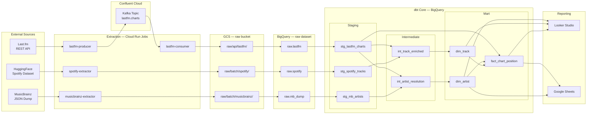
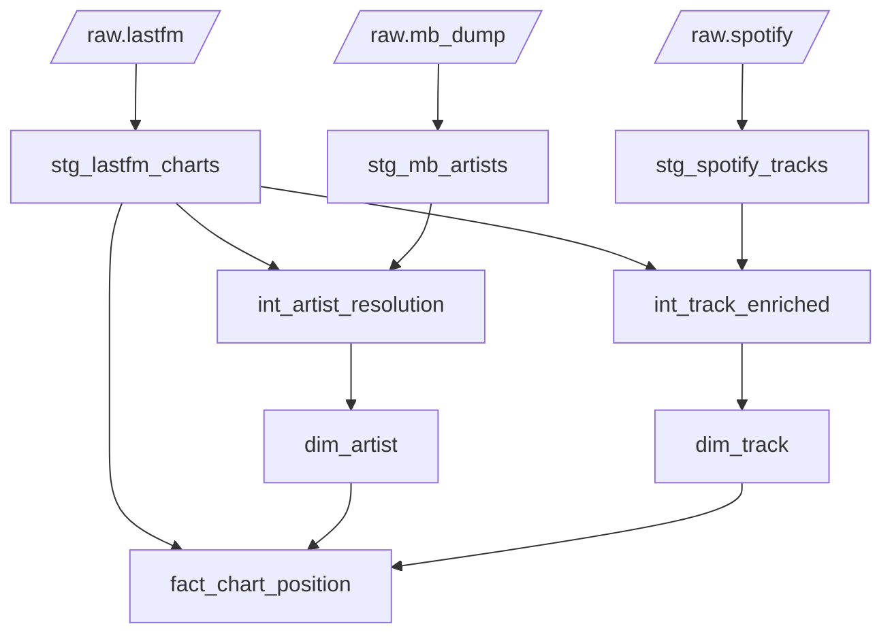
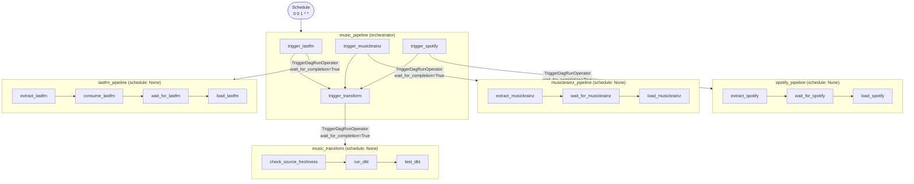

# Technical Design Document — gcp-music-0001

**Status:** In Development  
**Last updated:** 2026-05-21  
**Author:** David Bryne Adedeji

---

## 1. Overview

A monthly music intelligence pipeline that ingests chart, artist, and track data from three external sources, unifies them in BigQuery via dbt, and surfaces insights through Looker Studio and Google Sheets. The pipeline runs on the first of each month, orchestrated by Airflow on Astronomer Cloud, with all infrastructure provisioned on GCP via an idempotent gcloud CLI bootstrap script.

The central analytical question: **which artists and tracks are dominating charts, and what do we know about them?**

---

## 2. Goals

- Ingest Last.fm weekly chart data, MusicBrainz artist metadata, and a Spotify tracks dataset on a monthly cadence
- Produce a clean dimensional model (`dim_artist`, `dim_track`, `fact_chart_position`) in BigQuery
- Resolve artist identities across sources using MusicBrainz MBID as the canonical key
- Deliver four dashboard pages in Looker Studio and a structured Google Sheets report

---

## 3. Non-Goals

- Real-time or sub-daily data freshness
- Track audio feature analysis beyond what the Spotify dataset provides
- User-level listening history (aggregate chart data only)

---

## 4. Stack

| Layer | Technology |
|:---|:---|
| Extraction | Cloud Run Jobs, Python 3.12, Pydantic |
| Messaging | Apache Kafka — Confluent Cloud |
| Storage | Google Cloud Storage |
| Warehousing | Google BigQuery |
| Transformation | dbt Core + dbt-utils |
| Orchestration | Astronomer Cloud (managed Airflow) |
| Reporting | Looker Studio, Google Sheets |
| IaC | gcloud CLI (Shell) |
| CI/CD | GitHub Actions |
| Secrets | GCP Secret Manager |
| Region | `europe-west2` (London) |

---

## 5. Architecture

### 5.1 High-level diagram



---

### 5.2 Data sources

| Source | Type | Cadence | Volume |
|:---|:---|:---|:---|
| Last.fm `chart.getTopArtists` | REST API | Monthly run, paginated | ~50 artists/page, all pages |
| MusicBrainz artist dump | Batch download (`artist.tar.xz`) | Monthly | ~2M artist records, 2 GB compressed |
| Spotify tracks dataset | HuggingFace Parquet (`maharshipandya/spotify-tracks-dataset`) | Monthly snapshot | ~114k tracks, 13.6 MB |

---

### 5.3 Extraction layer

Four Cloud Run Jobs — stateless, run to completion, scale to zero.

**`lastfm-producer`** (`extractors/lastfm-producer/`)

Paginates `chart.getTopArtists` at 0.2 s per page (5 req/s limit). Each artist is validated as an `ArtistChart` Pydantic record and produced to the `lastfm.charts` Kafka topic on Confluent Cloud. Empty MBIDs from the API are normalised to `None`. Delivery errors are surfaced via the on_delivery callback and raised after `flush()` so no failures are silently swallowed.

**`lastfm-consumer`** (`extractors/lastfm-consumer/`)

Drains the `lastfm.charts` topic using a 30-second silence window (6 × 5 s empty polls). Stamps a single `_ingested_at` UTC timestamp across all records in the batch, then writes NDJSON to `raw/api/lastfm/{chart_week}.ndjson`. Kafka offsets are committed only after a successful GCS write — failed writes can be replayed by re-running the job.

**`musicbrainz-extractor`** (`extractors/musicbrainz/`)

Resolves the latest dump version via the `LATEST` file, streams `artist.tar.xz` in 8 MB chunks computing SHA256 in parallel, verifies the checksum against `SHA256SUMS`, then stream-extracts the NDJSON from the XZ tarball. Only the nine fields the pipeline needs are retained (hyphenated keys normalised to snake_case, `life-span` flattened, genres reduced to a name list). Reduces GCS footprint from the full 2 GB dump to a compact filtered NDJSON.

**`spotify-extractor`** (`extractors/spotify/`)

Downloads the auto-generated Parquet export from HuggingFace (`refs/convert/parquet` revision), drops the serialised DataFrame index column (`Unnamed: 0`), stamps `_ingested_at`, and stages to `raw/batch/spotify/spotify_tracks.parquet`.

---

### 5.4 Storage layout

```
gs://portfolio-hub-2026-music-raw/
  raw/
    api/
      lastfm/            {chart_week}.ndjson   — one file per consumer run
    batch/
      musicbrainz/       mb_artists.ndjson     — filtered artist dump
      spotify/           spotify_tracks.parquet
```

---

### 5.5 BigQuery

| Dataset | Tables | Purpose |
|:---|:---|:---|
| `raw` | `lastfm`, `mb_dump`, `spotify` | GCS load targets — schema defined in `infra/schemas/*.json` |
| `music` | dbt mart models | Dimensional models consumed by reporting |

Table schemas are defined in `dags/schemas/*.json` — single source of truth used by both `infra/provision/bigquery.sh` (table creation) and the Airflow DAGs (`GCSToBigQueryOperator`).

---

## 6. dbt Model Lineage



### Model notes

**Staging**

- `stg_lastfm_charts` — casts types, generates `chart_key` surrogate on `artist_name + chart_week` (not MBID, which is nullable), passes through `_ingested_at`
- `stg_mb_artists` — maps dump fields; parses `begin_date`/`end_date` strings via `safe.parse_date`; `artist_type` validated with `accepted_values`
- `stg_spotify_tracks` — range tests on all 0–1 audio features, `popularity` 0–100, `key` 0–11, `mode` accepted_values [0, 1]

**Intermediate**

- `int_artist_resolution` — MBID join is the primary resolution path. For artists without an MBID, a second left join on normalised name (`lower(regexp_replace(trim(name), r'[^a-z0-9 ]', ''))`) fires as a fallback. `qualify row_number()` deduplicates cases where a single normalised name maps to multiple MusicBrainz records. `is_mb_verified` distinguishes both paths.
- `int_track_enriched` — joins Spotify tracks to Last.fm charting artists via `contains_substr()` on normalised artist name against the Spotify `artists` field. One row per Spotify track per matched chart artist; `dim_track` deduplicates on `track_id`.

**Mart**

- `dim_artist` — one row per artist, MBID as natural key, surrogate `artist_key`
- `dim_track` — one row per `track_id`, full Spotify audio feature set. Deduplicates `int_track_enriched` on `track_id`, taking the highest-popularity row
- `fact_chart_position` — one row per artist × chart week; grain is artist × `chart_week`. Audio feature analysis is available via `dim_artist → dim_track` through `int_track_enriched` — adding `track_key` to this fact would break the grain

---

## 7. Orchestration

Five DAGs on Astronomer Cloud. `music_pipeline` is the only scheduled DAG; the rest run on trigger only, preventing race conditions and unintended runs.



Each `TriggerDagRunOperator` uses `wait_for_completion=True` and `poke_interval=60` — the orchestrator blocks on each sub-DAG and only advances when it succeeds. A failure in one source does not affect the others and can be restarted in isolation without re-running the full pipeline.

**Astronomer deployment**

| Setting | Value |
|:---|:---|
| Workspace | `data-portfolio` |
| Deployment | `gcp-music-0001` |
| Runtime | Astro 3.2-4 (Airflow 3.2.1) |
| Executor | Astro Executor |
| Scheduler | Small (up to 50 DAGs) |
| Region | `us-central1` |
| DAG sync | `github.com/dbryne03/gcp-music-0001`, branch `main`, root path |
| GCP connections | `music-airflow-sa` (explicit `gcp_conn_id`), `google_cloud_default` (impersonation fallback for sensors) |

**Airflow 3.x compatibility notes**
- All DAGs prepend `sys.path.insert(0, str(Path(__file__).parent))` — required because Airflow 3 DAG bundles do not automatically add `dags/` to `sys.path`
- `TriggerDagRunOperator` imported from `airflow.providers.standard.operators.trigger_dagrun` (moved from core in Airflow 3)
- `GCSObjectExistenceSensor` uses `google_cloud_default` connection — `gcp_conn_id` parameter removed as it is not accepted in `apache-airflow-providers-google>=13.0.0`
- `google_cloud_default` connection uses Workload Identity impersonation via the Astronomer deployment SA (`astro-continuous-horizon-8866@...`) → `music-airflow-sa`

**Astro project files** (repo root)

| File | Purpose |
|:---|:---|
| `Dockerfile` | Extends `quay.io/astronomer/astro-runtime:3.2-4`; `requirements.txt` is installed automatically |
| `packages.txt` | OS packages — empty but required by Astro Runtime ONBUILD |
| `requirements.txt` | `apache-airflow-providers-google>=13.0.0`, `apache-airflow-providers-standard>=1.0.0` |
| `.astro/config.yaml` | Marks directory as Astro project for CLI recognition |

---

## 8. Infrastructure

GCP resources are provisioned by focused shell scripts in `infra/`. All scripts are idempotent, source shared variables from `infra/config.env`, and run automatically via GitHub Actions on every merge to `main`.

**Script naming convention:** scripts prefixed with `_` are manual-only — never called by CI. They require owner-level credentials and are run once from a local terminal (sensitive privilege operations that a service account should not self-manage).

```
infra/
  config.env            Shared KEY=VALUE configuration (no secrets)
  provision/            Static infrastructure — no image dependency
    apis.sh             GCP API enablement                            [auto]
    storage.sh          GCS bucket + lifecycle rules                  [auto]
    bigquery.sh         BigQuery datasets + raw tables                [auto]
    registry.sh         Artifact Registry repository                  [auto]
    secrets.sh          Secret Manager secret placeholders            [auto]
    iam.sh              Service accounts + resource-scoped IAM        [auto]
    _project_iam.sh     Project-level IAM for pipeline SAs            [manual]
    _wif.sh             Workload Identity Federation setup            [manual]
  deploy/               Application workloads — runs after images are pushed
    jobs.sh             Cloud Run Job create/update                   [auto]
  lifecycle.json        GCS object retention policy
dags/schemas/           BigQuery raw table schema definitions (shared with infra)
```

**Provisioned**
- GCS bucket (`portfolio-hub-2026-music-raw`) with uniform bucket-level access
- GCS lifecycle rule: `raw/` objects deleted after 90 days
- BigQuery datasets: `raw`, `music`
- BigQuery raw tables: `raw.lastfm`, `raw.mb_dump`, `raw.spotify`
- Artifact Registry repository: `music-pipeline` (Docker, `europe-west2`)
- Secret Manager secrets: `lastfm-api-key`, `kafka-bootstrap-servers`, `kafka-api-key`, `kafka-api-secret`
- Service accounts: `music-cloudrun-sa`, `music-airflow-sa`
- IAM bindings:
  - `music-cloudrun-sa` → `storage.objectAdmin` on raw bucket, `bigquery.dataEditor` + `bigquery.jobUser` at project, `secretmanager.secretAccessor` on all secrets
  - `music-airflow-sa` → `run.invoker` + `run.developer` at project, `storage.objectViewer` on raw bucket, `bigquery.jobUser` + `bigquery.dataEditor` at project
  - `astro-continuous-horizon-8866@...` → `serviceAccountTokenCreator` on `music-airflow-sa` (Workload Identity impersonation for Airflow operators)
- Cloud Run Jobs with per-job CPU/memory configuration:

| Job | CPU | Memory | Env / Secrets |
|:---|:---|:---|:---|
| `lastfm-producer` | 1 | 512Mi | GCS bucket, Kafka topic, Last.fm + Kafka secrets |
| `lastfm-consumer` | 1 | 512Mi | GCS bucket, Kafka topic, Kafka secrets |
| `musicbrainz-extractor` | 2 | 4Gi | GCS bucket (4Gi required for XZ archive decompression) |
| `spotify-extractor` | 1 | 1Gi | GCS bucket |
| `dbt-runner` | 2 | 2Gi | — (uses Cloud Run SA + profiles.yml) |

**Manual (not in script)**
- `github-actions-sa` — created by hand with owner credentials; WIF attribute conditions configured in `_wif.sh`
- Secret values — added via GCP console (`gcloud secrets versions add`)

---

## 9. Security

**Secrets**
- All credentials stored in GCP Secret Manager; injected as environment variables into Cloud Run Jobs at runtime — never in source code or Docker images
- `.env` is gitignored; `.env.example` documents required variables with no values
- Kafka broker uses SASL_SSL (encrypted + authenticated transport)

**Containers**
- All Docker images run as a non-root system user (UID 1000) — reduces blast radius if a dependency exploit achieves code execution inside a container
- Dependency versions are upper-bounded (`>=x.y,<x+1.0`) to prevent silent major version upgrades introducing breaking changes or known-vulnerable releases

**GCP IAM**
- Uniform bucket-level access — no per-object ACLs
- Each service account holds only the roles required for its specific operations; no SA has project-wide owner or editor
- `DEPLOY_SHA` in `deploy/jobs.sh` is validated as a 40-character hex SHA before use as a Docker image tag
- CI (`github-actions-sa`) holds provisioning roles only. Project-level IAM for pipeline SAs (`bigquery.dataEditor`, `run.invoker`, etc.) is granted via `_project_iam.sh` (manual-only, not delegated to CI)

**GitHub Actions**
- Global `permissions: contents: read`; deploy jobs explicitly elevate to `id-token: write`
- Authentication uses Workload Identity Federation (OIDC) — no long-lived JSON keys in GitHub Secrets. Pool and provider are configured in `infra/provision/_wif.sh` (manual-only)
- Docker layer cache uses `type=gha` scoped per image — no cross-image cache pollution

---

## 10. CI/CD

Three focused workflow files chain via `workflow_run` — each fires when the previous completes successfully on `main`. PRs trigger only `validate.yml`.

```
Validate ──(main, on success)──► Infrastructure ──(on success)──► Deploy
```

**`validate.yml`** — runs on every PR and push

| Job | Description |
|:---|:---|
| `dags` | `py_compile` on all DAG files — catches syntax errors before Astronomer sync |
| `dbt` | Writes CI dbt profile, runs `dbt deps` + `dbt parse` |
| `extractors` (matrix ×4) | `pip install` with cached deps + `pytest` |
| `docker` (matrix ×5) | Docker build with GHA layer cache; no push |

**`infra.yml`** — triggered by Validate completing on `main`
- Authenticates to GCP, runs each provision script as a discrete named step
- `cancel-in-progress: false` — partial infra state is worse than a stale run

**`deploy.yml`** — triggered by Infrastructure completing on `main`
- Accepts optional `sha` input for targeted redeploys without a new commit
- Builds and pushes all images with GHA layer cache; tags with commit SHA and `latest`
- `workloads` job gates on `images` succeeding before deploying Cloud Run Jobs
- `deploy-astronomer` job uses `astronomer/deploy-action@v0.13.0` with `deploy-type: image-and-dags` to rebuild the Airflow image (installing `requirements.txt`) and sync DAGs to the Astronomer deployment

Commit SHA and PR title/commit message propagate through all three workflows via `run-name` and `github.event.workflow_run.head_commit.message`.

---

## 11. Alerting

Pipeline failures trigger an email alert to the configured `ALERT_EMAIL` address via Airflow's SMTP backend. The `on_pipeline_failure` callback distinguishes three failure classes and emits structured log entries alongside the email:

| Task | Log prefix | Meaning |
|:---|:---|:---|
| `check_source_freshness` | `STALE SOURCE DATA` | One or more raw tables were not loaded within the freshness threshold |
| `test_dbt` | `DATA QUALITY FAILURE` | dbt tests failed — data quality regression |
| Any other task | `PIPELINE FAILURE` | Infrastructure or extraction error |

Email delivery uses Gmail SMTP with an App Password. The required Airflow environment variables are set in the Astronomer deployment (`AIRFLOW__SMTP__*`). Email send is best-effort — a delivery failure is logged but does not mask the original task failure.

---

## 12. Open Items

| Area | Item |
|:---|:---|
| Reporting | Connect BigQuery to Looker Studio — build four dashboard pages |
| Reporting | Connect BigQuery to Google Sheets via native connector |
